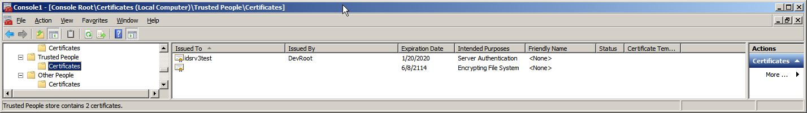

# How to install the test certificates #

The TestOptionsFactory uses an embedded certificate for token signing and validation. So there are no additional steps necessary. 
On machines where you want to consume tokens, you only need to install the idsrv3test.cer into the local computer/trusted people store (see step 3).

If you want to load certificates from the certificate store, we provide the idsrv3test public/private key pair for testing (including the root certificate). Use the following instructions:

## Install idsrv3test.pfx

Open mmc.exe and add the certificates snap-in. Use the local computer store.

1. Expand Personal under Certificates (Local Computer)
2. Right Click Certificates
3. Select All Tasks -> Import...
4. Click Next
5. Browse to the idsrv3test.pfx file
6. Click Next
7. Enter idsrv3test as the password
8. Click Next
9. Click Next (again)
10. Click Finish
 
When you are finished, it should look like the below screenshot.

## Grant Access to the imported certificate

1. Go to Personal under Certificates (Local Computer) -> Personal -> Certificates
2. Right click the certificate
3. Select All Tasks 
4. Click Manage private key on the imported certificate
5. Grant your account read access

## Add idsrv3test.cer into your Trusted People

1. Go to Personal under Certificates (Local Computer) -> Trusted People -> Certificates
2. Right Click Certificates
3. Select All Tasks
4. Click Import...
5. Click Next
6. Browse to idsrv3test.cer
7. Click Next
8. Click Next (again)
9. Click Finish

When you are finished, it should look like the below screenshot.

